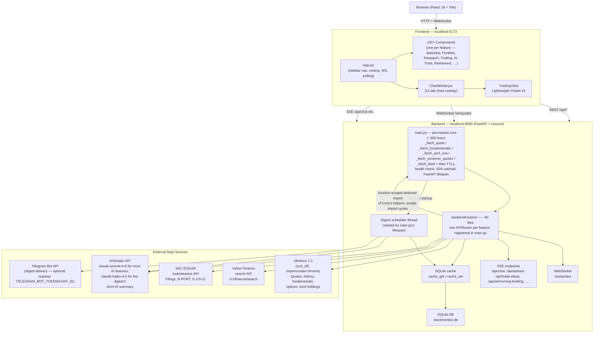
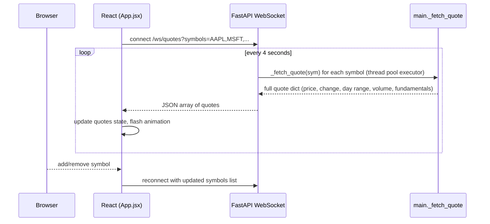
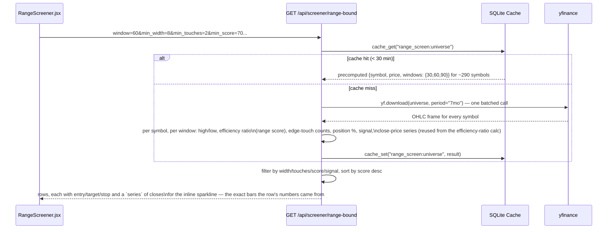
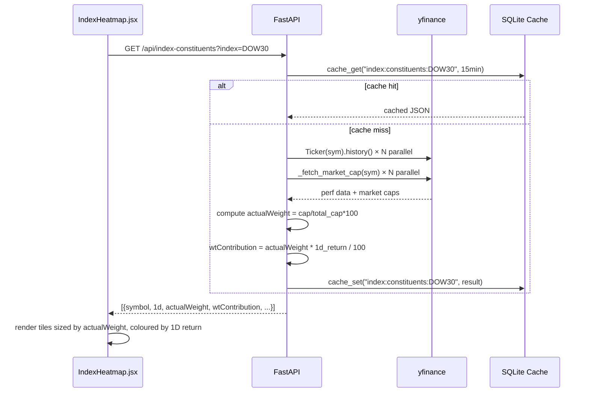
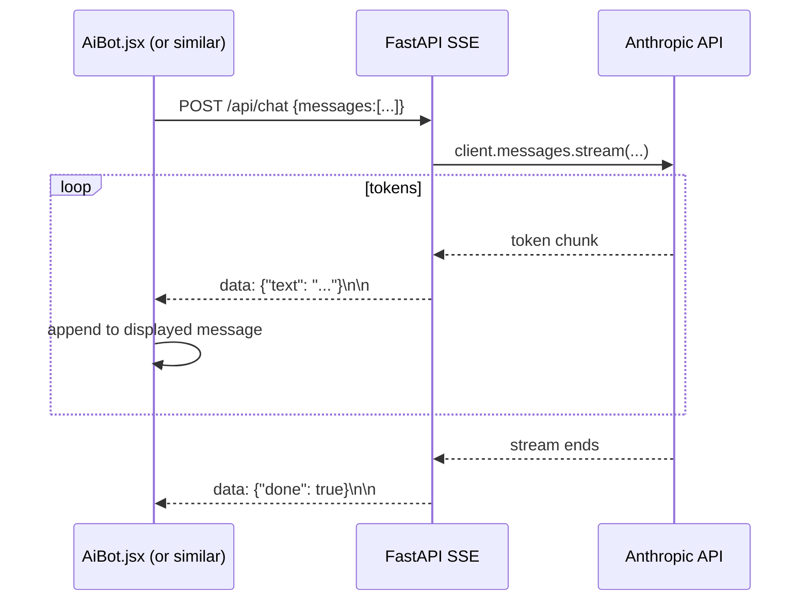
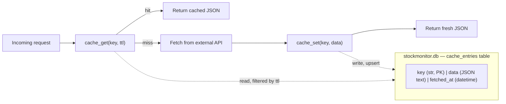

# Stock Monitor — Architecture

> Reflects the modularized backend (main.py reduced from ~12,300 lines to its permanent
> core, everything else in `backend/routers/`) plus the daily/weekly digest scheduler and
> range screener added after that effort. See `CHANGELOG.md` for the full build history.

## System Overview



**Why the core is small:** `main.py` was a 12,269-line monolith as of mid-2026 and was extracted, section by section, into `backend/routers/` until only what's genuinely shared by nearly every router — the five `_fetch_*` helper functions and their TTLs, the health check, and the SPA catchall — remained. Extracting that core further would just move the "everything imports from here" problem to a different file, not remove it, so it's the intended floor for this architecture.

**Deferred imports:** because `main.py` imports every router module to register it (`app.include_router(...)`), a router importing something from `main.py` at module load time would create a circular import. The fix used throughout the codebase is a *function-scoped* deferred import — `from main import _fetch_perf_one` written inside the endpoint function body, not at the top of the file — which only resolves at request time, after both modules have finished loading.

## Data Flow — Live Price Feed (WebSocket)



`routers/websocket_quotes.py` runs the blocking `_fetch_quote` calls in a thread-pool executor per tick so the async event loop isn't blocked; each quote itself is cached the normal way (`quote:{symbol}`, part of `_MARKET_TTL`), so a busy watchlist doesn't re-fetch from Yahoo every 4 seconds for symbols other tabs already warmed.

## Data Flow — Daily / Weekly Digest

```mermaid
sequenceDiagram
    participant Sched as digest_service (background thread)
    participant Log as digest_log table
    participant Build as digest_builder
    participant AI as Anthropic (optional)
    participant Chan as digest_channels (Telegram)

    loop every 60 seconds
        Sched->>Sched: due_runs(settings, now) — is a daily/weekly digest due,\nwithin its catch-up window, for a channel that's configured?
        alt due
            Sched->>Log: claim (kind, period_key) — INSERT, unique constraint\nmakes a duplicate tick lose the race
            Log-->>Sched: claimed (or skip if already sent/in flight)
            Sched->>Build: build_digest(kind, now) — market, portfolio, watchlist,\nevents, alerts, targets (each section isolated;\na failing source drops only that section)
            Build-->>Sched: structured digest
            opt AI summary enabled
                Sched->>AI: short opener from the same numbers
                AI-->>Sched: text (or nothing, swallowed on any failure)
            end
            Sched->>Chan: send rendered HTML, chunked under Telegram's message limit
            Chan-->>Sched: ok / error (token redacted from any error text)
            Sched->>Log: mark sent — or failed, retried up to 3x, 10 min apart
        end
    end
```

Started by `main.py`'s `lifespan` on startup (`DIGEST_SCHEDULER=0` disables it) and stopped on shutdown. A `POST /api/digest/send` (manual, from the Digests tab) reuses the same `run_digest()` path with a trigger of `"manual"` instead of `"scheduled"`, and manual runs are never deduped against each other.

## Data Flow — Range Screener



An optional `symbols=` query param bypasses the cached universe and scans a caller-supplied list instead — not cached, since arbitrary combinations aren't worth persisting. The frontend's inline sparkline is drawn from `series` directly rather than a second chart request, so it can never show a different window than the metrics beside it.

## Data Flow — Index / ETF Heatmap



## Data Flow — AI Streaming (Chat / Trade Ideas / Morning Briefing)



## Component Map (by Navigation Group)

The sidebar has grown to 100+ components across 11 groups; this lists representative components per group rather than every file — see `frontend/src/App.jsx` for the authoritative nav structure.

```
Home
└── HomeDashboard.jsx          Aggregated P&L, market pulse, movers, earnings, alerts, ⌘K palette

Markets
├── MarketSummary.jsx          Overview: indices, sectors, Mag7, movers, news
├── IndexHeatmap.jsx           Constituent heatmap with dynamic ETF search
├── SectorDashboard.jsx        Sector rotation table + heatmap
├── YieldCurve.jsx             Treasury curve + DXY
└── FedWatch.jsx                FOMC cut/hold/hike odds

Watchlist
├── StockTable.jsx             Live watchlist with flash animations
├── RichEarningsCalendar.jsx   Earnings+ (expected move, beat rate, drift)
└── SmartAlerts.jsx            Condition scanner (volume, RSI, crossovers)

Research
├── Screener.jsx                Technical/fundamental/NLP screener
├── RangeScreener.jsx           30/60/90-day support/resistance scan
├── TechnicalSignals.jsx        Multi-timeframe signals dashboard
├── Backtester.jsx              MA crossover / RSI / Bollinger backtest
└── DcfCalculator.jsx           DCF intrinsic value calculator

Trading
├── DayTrader.jsx               Trading plan + playbooks + intraday scanner
└── PositionSizer.jsx           Fixed fractional / ATR / Half-Kelly sizer

Merger Arb / SPACs
└── (7 views each: overview, dashboard/tracker, scanner/discovery,
     deal analyzer, portfolio, risk matrix, alerts)

Portfolio
├── PortfolioTracker.jsx        11 views: heatmap, risk, optimizer, correlation
├── OptionsTracker.jsx          Options P&L with live Greeks
└── TradeJournal.jsx            Trade log with P&L matching + win rate

AI Tools
├── AiBot.jsx                   Streaming Claude chat (SSE)
├── MorningBriefing.jsx         AI-generated pre-market briefing (SSE)
├── DigestCenter.jsx            Daily/weekly digest settings, preview, send, history
└── FinancialAdvisor.jsx        AI portfolio strategy (SSE)

Retirement
└── (8 calculators: FIRE, Coast FIRE, Monte Carlo, Social Security,
     Roth conversion, Medicare, Estate & RMD, …)

Help
├── UserGuide.jsx                In-app documentation
└── InvestorEducation.jsx        5-layer onion map of investing concepts, with
                                  live data snapshots and deep links to matching tools

Shared
└── ChartModal.jsx               11-tab overlay (chart, fundamentals, news,
                                  earnings, options, strategies, insider,
                                  analyst, institutional, sentiment, SEC filings)
```

## Caching Architecture



`cache_get(key, ttl)` and `cache_set(key, data)` in `database.py` are the only way any router touches the cache — a plain key/value table with the freshness window passed in by the caller at read time, not stored per row. A representative sample of prefixes and TTLs actually in use (not exhaustive — see the router named in parentheses):

| Cache key prefix | TTL | Data |
|---|---|---|
| `quote:` | 15 min (`_MARKET_TTL`, main.py) | Live quote (price, change, day range, fundamentals) |
| `fund:` | 5 min (`_FUND_TTL`, main.py) | Fundamentals (P/E, EPS, beta, …) |
| `chart:{symbol}:{period}` | 1 min–24 hr, scaled to the period (`routers/chart.py`) | OHLCV bars |
| `news:` | 5 min (`routers/news.py`) | Headlines |
| `index:constituents:{index}` | 15 min (`routers/index_constituents.py`) | Index/ETF constituent weights + returns |
| `earnings:` | 4 hr (`routers/earnings_calendar.py`) | Upcoming earnings dates + EPS estimates |
| `rich_earn:` | 2 hr (`routers/rich_earnings_calendar.py`) | Expected move, beat-rate history, pre-earnings drift |
| `div:` | 6 hr (`routers/dividend_tracker.py`) | Dividend history/yield |
| `range_screen:universe` | 30 min (`routers/range_screener.py`) | Precomputed range-screen metrics for the default ~290-symbol universe |
| `home:summary` | 2 min (`routers/portfolio.py`) | Home dashboard aggregate (portfolio P&L + market pulse) |

## Key Backend Patterns

**Parallel fetching with ThreadPoolExecutor**
```python
with ThreadPoolExecutor(max_workers=20) as ex:
    futures = {ex.submit(_fetch_perf_one, sym): sym for sym in symbols}
    for f in as_completed(futures):
        results[futures[f]] = f.result()
```
Used throughout — index constituent perf, market performance, technical signals, the digest builder's per-symbol price lookups, the range screener's earnings-date lookups.

**Function-scoped deferred imports** (see "Why the core is small" above)
```python
@router.get("/api/some-feature")
def some_endpoint():
    from main import _fetch_perf_one   # resolved at call time, not module load
    ...
```

**WebSocket price broadcaster**
```python
@router.websocket("/ws/quotes")
async def ws_quotes(websocket: WebSocket, symbols: str = ""):
    from main import _fetch_quote
    await websocket.accept()
    loop = asyncio.get_event_loop()
    while True:
        results = await loop.run_in_executor(None, lambda: [_fetch_quote(s) for s in syms])
        await websocket.send_json(results)
        await asyncio.sleep(4)
```

**SSE streaming for AI endpoints**
```python
def generate():
    with anthropic_client.messages.stream(...) as stream:
        for text in stream.text_stream:
            yield f"data: {json.dumps({'text': text})}\n\n"
    yield f"data: {json.dumps({'done': True})}\n\n"

return StreamingResponse(generate(), media_type="text/event-stream")
```

**Background scheduler + at-most-once claiming** (digests)
A daemon thread started by `main.py`'s FastAPI `lifespan` ticks every 60 seconds, checking whether a daily or weekly digest is due (and still within a catch-up window, for a machine that was asleep at the scheduled time). Before doing any work it claims `(kind, period_key)` — e.g. `("daily", "2026-09-23")` or `("weekly", "2026-W39")` — as a row in `digest_log`, whose unique constraint makes a duplicate tick (or a second process) lose the race and skip. A failed delivery retries up to 3 times, 10 minutes apart.

**Test database isolation**
`backend/tests/conftest.py`'s autouse `isolated_db` fixture points `database.SessionLocal` at a throwaway SQLite database for the duration of each test, so the test suite never reads or writes `backend/stockmonitor.db`. This works for every router with no per-router change, because `db_session()`/`cache_get()`/`cache_set()` in `database.py` resolve `SessionLocal` by module-level name at call time rather than capturing it at import time.
