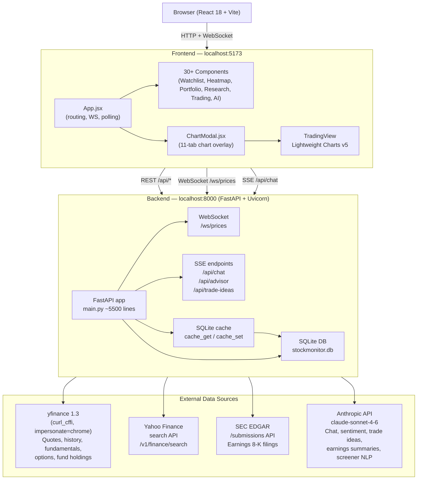
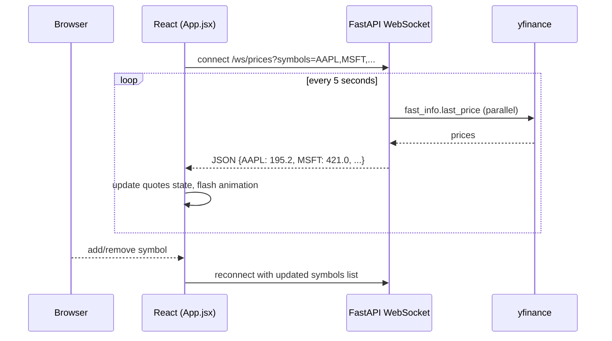
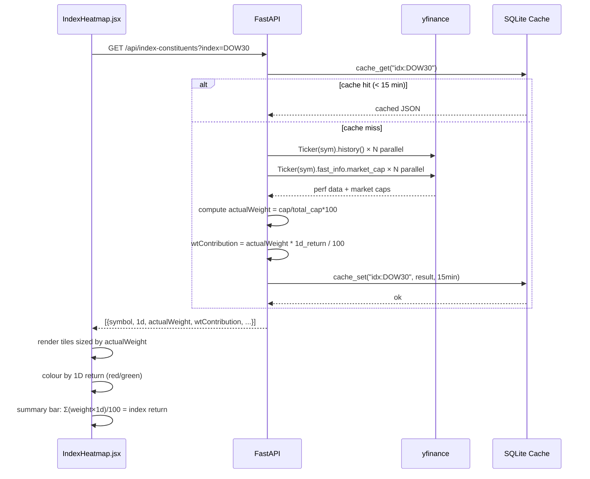
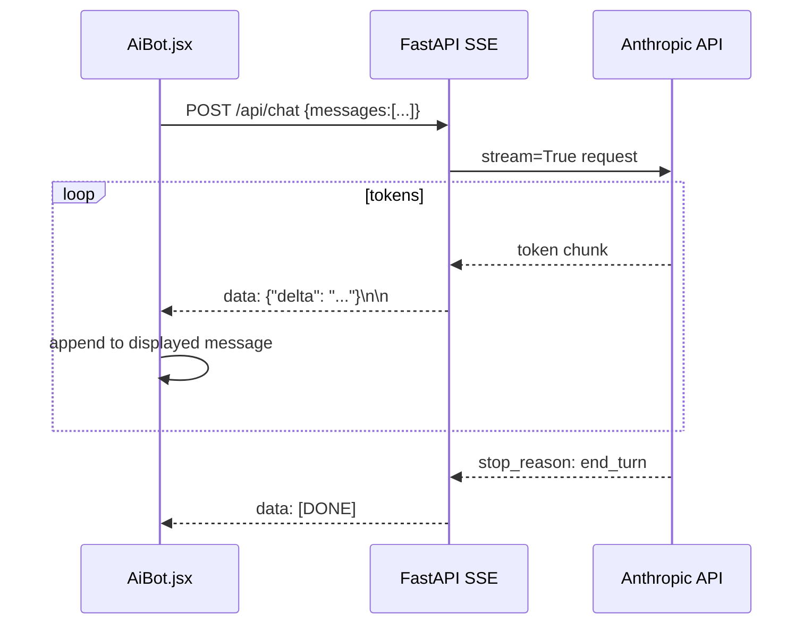
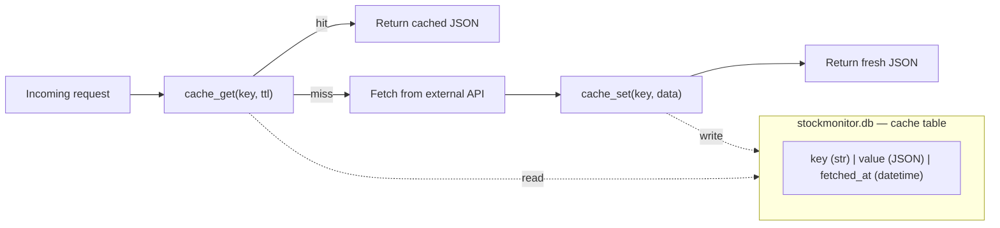

# Stock Monitor — Architecture

## System Overview



## Data Flow — Live Price Feed



## Data Flow — Index / ETF Heatmap



## Data Flow — AI Streaming (Chat / Trade Ideas)



## Component Map (by Navigation Group)

```
Markets
├── MarketSummary.jsx         Overview: indices, sectors, Mag7, movers, news
├── MarketRecommendations.jsx Analyst picks + AI Growth Watch List
├── MarketBreadth.jsx         A/D ratio, MA breadth, VIX, put/call
├── IndexHeatmap.jsx          Constituent heatmap with dynamic ETF search
├── SectorDashboard.jsx       Sector rotation table + heatmap
├── SectorMomentum.jsx        Sector momentum ranker with acceleration signals
├── MacroCalendar.jsx         FOMC, CPI, PPI, PCE, NFP, GDP calendar
└── YieldCurve.jsx            Treasury curve + DXY

Watchlist
├── StockTable.jsx            Live watchlist with flash animations
├── PriceTargets.jsx          Personal price targets with progress bars
├── RichEarningsCalendar.jsx  Earnings+ (expected move, beat rate, drift)
├── NewsSentiment.jsx         AI news sentiment scoring (Claude)
└── SmartAlerts.jsx           Condition scanner (volume, RSI, crossovers)

Portfolio
├── PortfolioTracker.jsx      11 views: heatmap, risk, optimizer, correlation
├── OptionsTracker.jsx        Options P&L with live Greeks
└── TradeJournal.jsx          Trade log with P&L matching + win rate

Research
├── Screener.jsx              Technical/fundamental/NLP screener
├── TechnicalSignals.jsx      Multi-timeframe signals dashboard
├── StockComparison.jsx       Normalised return chart compare
├── FundamentalComparison.jsx 21-metric side-by-side comparison
├── Backtester.jsx            MA crossover / RSI / Bollinger backtest
├── DcfCalculator.jsx         DCF intrinsic value calculator
└── UnusualOptions.jsx        Unusual options activity scanner

Trading
├── DayTrader.jsx             Trading plan + playbooks + intraday scanner
├── TradeIdeas.jsx            AI-generated trade setups (Claude, SSE)
└── PositionSizer.jsx         Fixed fractional / ATR / Half-Kelly sizer

AI Tools
├── AiBot.jsx                 Streaming Claude chat (SSE)
└── FinancialAdvisor.jsx      AI portfolio strategy (SSE)

Shared
└── ChartModal.jsx            11-tab overlay (chart, fundamentals, news,
                              earnings, options, strategies, insider,
                              analyst, institutional, sentiment, SEC filings)
```

## Caching Architecture



| Cache key prefix | TTL | Data |
|---|---|---|
| `fund:` | 2 hours | Fundamentals (PE, EPS, beta, …) |
| `chart:` | 5 min (1d/5d) / 1 hr (1mo+) | OHLCV bars |
| `news:` | 30 min | Headlines |
| `breadth:` | 30 min | A/D ratio, VIX, put/call |
| `rates:` | 30 min | Treasury yields, DXY |
| `earn:` | 4 hours | Earnings calendar |
| `opts:` | 5 min | Options chains |
| `idx:` | 15 min | Index/ETF constituents |
| `etf:` | 15 min | Dynamic ETF holdings |
| `uopts:` | 30 min | Unusual options |
| `filing:` | 12 hours | SEC 8-K filings |
| `earnsumm:` | 24 hours | AI earnings call summary |
| `secmom:` | 30 min | Sector momentum scores |
| `sent:` | 2 hours | News sentiment scores |

## Key Backend Patterns

**Parallel fetching with ThreadPoolExecutor**
```python
with ThreadPoolExecutor(max_workers=20) as ex:
    futures = {ex.submit(_fetch_perf_one, sym): sym for sym in symbols}
    for f in as_completed(futures):
        results[futures[f]] = f.result()
```
Used for: index constituent perf + market caps, market performance, signals.

**WebSocket price broadcaster**
```python
@app.websocket("/ws/prices")
async def price_feed(ws: WebSocket, symbols: str):
    await ws.accept()
    while True:
        prices = {s: fast_info_price(s) for s in symbol_list}
        await ws.send_json(prices)
        await asyncio.sleep(5)
```

**SSE streaming for AI endpoints**
```python
async def stream_claude(messages):
    with anthropic_client.messages.stream(...) as s:
        for text in s.text_stream:
            yield f"data: {json.dumps({'delta': text})}\n\n"

return StreamingResponse(stream_claude(messages), media_type="text/event-stream")
```
